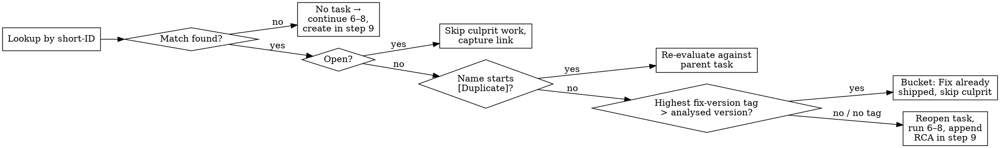

# ddg-sentry-report

## Overview

Produces a structured Sentry crash triage report for a DuckDuckGo Apple release and files it as a new subtask under a parent Asana task. The parent is either supplied by the user as a URL, or auto-resolved from the platform's Weekly Release DRI task → today's "<Weekday> status" subtask. Distinguishes pre-existing issues from new-in-version regressions, sorts by severity, attributes likely authors via git blame (initials + PR links only — never full names).

## Supporting files

- [`references/constants.md`](references/constants.md) — Sentry/Asana GIDs, slugs, project filters, release-string conventions.
- [`templates/main-report.html`](templates/main-report.html), [`templates/crash-free.html`](templates/crash-free.html), [`templates/per-issue-tracking.html`](templates/per-issue-tracking.html) — `html_notes` bodies.
- [`references/common-mistakes-extended.md`](references/common-mistakes-extended.md) — overflow learnings beyond the inline table.
- [`examples.md`](examples.md) — two end-to-end walkthroughs (with URL, auto-resolve).

## Authorisation & PII (cross-cutting — applies to every Asana write)

- **The user invocation is the explicit authorization.** A user running `/ddg-sentry-report` (or naming this skill) authorises the workflow's writes — including filing a "Crash-free release" subtask when there's no data to triage. Don't gate on auto-mode safety checks, ask for re-confirmation before each write, or substitute a "no events found, stopping" message in place of the subtask. The daily DRI status subtask depends on getting an entry every day, including days where the answer is "nothing to triage."
- **PII: initials + PR links only, never full names.** The DDG asana-exfiltration hook scans task writes and blocks full employee names — even when the user approves in chat (the hook can't see chat). Use first-letter-of-first-name + first-letter-of-last-name initials, and link the PR so the author is one click away on GitHub. If even initials get blocked, fall back to PR-number-only attribution. Applies to the main report **and** the per-issue tracking-task bodies.
- **Never retry a BLOCKED Asana response with different params.** The data-protection policy says: accept the block, ask the user how to proceed.

## Reporting tone (cross-cutting — applies to every line of the report body)

- **Anchor every finding and recommendation to `<TIME_RANGE>`.** The analysis only sees Sentry events whose latest occurrence falls inside the resolved window. Phrase positive findings as "No new regressions in the last `<TIME_RANGE>`" rather than "No new regressions in {version}"; the unscoped form reads as a release-wide claim that this report does not support.
- **Never write a release-readiness verdict.** No "ship it", "proceed with confidence", "release looks healthy". The skill produces a windowed Sentry summary, not a sign-off. If nothing actionable came up, say so directly ("No action items surfaced in the last `<TIME_RANGE>` window; continue monitoring as the release rolls out") and stop.
- **Don't invent skip rationales.** The Recommended-next-step block is not the place to retroactively justify omissions. If you skipped a tracking task, the legitimate reason belongs in the per-issue line.

## Parameters

| Param | Example | Notes |
|---|---|---|
| Project | `iOS` or `macOS` | Maps to Sentry project slug `apple-ios` / `apple-macos`. A single version ships under multiple release strings (main app + extensions) — see [constants](references/constants.md). |
| Asana parent task URL (optional) | `https://app.asana.com/1/137249556945/task/1214175611004136` | Extract the task GID from the URL path — this is the **parent** task. The summary report is created as a **new subtask** under it (never written to the parent itself). Subtask name: `Sentry summary - <platform> <version> - <YYYY-MM-DD>`. **If omitted**, auto-resolve via 1.2 below. |
| Version (optional) | `1.186.0`, `1.186.*`, or `1.186` (macOS) / `7.216.x` (iOS) | Pass-through: an exact version (`1.186.0`) goes to `app_version:1.186.0`; a series (`1.186` or `1.186.*`) becomes the wildcard `app_version:1.186.*`. Always use the wildcard form when the user supplies a series. **If omitted**, the version is auto-resolved from Asana via the `release-type` parameter (1.3 below). The auto-resolved value is collapsed to a major.minor wildcard (e.g. `7.218.0` → `7.218.*`) so the report covers all patch releases in the series. |
| Release-type (optional) | `public` or `internal` | **Only consulted when `version` is omitted.** Selects which Asana project to look up the version in. See 1.3 below. **If both `version` and `release-type` are omitted**, stop and ask the user — do NOT pick a default. |
| Time range (optional) | `24h`, `72h`, `7d`, `14d` | Sentry-style relative time. **Default when omitted:** `72h` on Monday (covers Friday–Sunday), `24h` otherwise. Determine via `date +%u` (Bash; `1`=Monday … `7`=Sunday). The resolved value is appended to step-3 `list_issues` queries as `lastSeen:-<range>` and substituted into the rewritten query URLs as `&statsPeriod=<range>`. **Does NOT apply** to step 2's crash-free check (a global "is there any data" query — adding a time filter would cause false crash-free readings for versions whose only events fall outside the window). |

## Workflow

## Step 1: Resolve inputs

### 1.0 Load MCP tools (via ToolSearch)

- Sentry: `mcp__sentry__find_projects`, `mcp__sentry__find_releases`, `mcp__sentry__list_issues`, `mcp__sentry__get_sentry_resource`
- Asana: `asana_get_task`, `asana_update_task`, `asana_search_tasks`, `asana_create_task`, `asana_add_task_followers` — the namespace prefix varies by environment: `mcp__asana__` (Claude Agent SDK / direct Asana MCP) or `mcp__plugin_asana_asana__` (Claude Code with the Asana plugin). Pass whichever full name `ToolSearch` surfaces in the current session to `select:`; the rest of this skill refers to the short names only.

### 1.1 Resolve `<TIME_RANGE>`

If the user supplied one, use it verbatim (validate it's a Sentry-style relative duration: `<integer><h|d|w>`). If omitted, run `date +%u` via Bash to get today's weekday number; `1` (Monday) → default to `72h`, anything else (`2`–`7`) → default to `24h`. Hold the resolved value as `<TIME_RANGE>` for use in steps 3 and 7, and surface it in the report body. The time range never affects step 2's crash-free check.

**Use `date` via Bash, not the conversation-context date.** Sessions cross day boundaries and users run from various time zones. Same applies to `date +%A` for the `<Weekday>` lookup in 1.2.

### 1.2 Resolve `<PARENT_GID>` (auto-resolve only when no Asana URL is supplied)

If the user provided a URL, extract the GID from `/task/<GID>` and use it as `<PARENT_GID>` directly — `<DRI_ASSIGNEE_GID>` stays null and step 11 is a no-op.

Otherwise auto-resolve via the platform's Weekly Release DRI task → today's `<Weekday> status` subtask:

1. **Find the Weekly Release DRI task.** Pick the platform project from [constants](references/constants.md) (iOS → `414709148257752`, macOS → `1201037661562251`) and the task name (`iOS App Weekly Release DRI` or `macOS App Weekly Release DRI`):
   ```
   asana_search_tasks(workspace="137249556945",
     projects.any="<PLATFORM_PROJECT_GID>",
     text="<platform> App Weekly Release DRI",
     completed=false,
     opt_fields="name,assignee,assignee.name,created_at,permalink_url",
     limit=20)
   ```
   The `text` filter is fuzzy — filter the returned list down to **exact** name matches (`name == "<platform> App Weekly Release DRI"`). Auxiliary "🧰 Create a new release DRI task" entries in the same project are NOT matches and must be discarded. Request `assignee` (not just `assignee.name`) so the response includes the assignee's `gid` — needed in step 11.
2. **Disambiguate when multiple match.** Apply in order:
   - If exactly one match has `assignee != null` → pick that one.
   - Otherwise (all assigned, or all unassigned) → pick the one with the most recent `created_at`.
3. **Find today's `<Weekday> status` subtask.** Get today's weekday name via `date +%A` (Bash). Then:
   ```
   asana_get_task(task_id="<DRI_TASK_GID>",
     opt_fields="subtasks,subtasks.name,subtasks.completed,subtasks.permalink_url,tags,tags.name")
   ```
   (`tags,tags.name` is required by the data-protection hook on every `asana_get_task` call.) Pick the subtask whose `name` contains `<Weekday> status` case-insensitively (e.g. `Tuesday status`, `Tuesday status (Apr 28)`). Prefer an incomplete subtask over a completed one if both exist; if multiple incomplete subtasks match, pick the one with the most recent `created_at` (fetch via `subtasks.created_at` opt field if needed).
4. Use that subtask's GID as `<PARENT_GID>`. Capture the DRI task's `assignee.gid` (from sub-step 1's response) as `<DRI_ASSIGNEE_GID>` for step 11. If the DRI task has no assignee, hold `<DRI_ASSIGNEE_GID>` as null and skip step 11 silently.
5. **Surface the resolution to the user** in your first text update (DRI task name + assignee name + status subtask name + permalink) so they can correct the choice before any writes happen.
6. **Stop and ask the user** if any auto-resolution step fails: no exact-name DRI match, no `<Weekday> status` subtask for today, or any unexpected ambiguity that the disambiguation rules don't resolve. Do NOT silently fall back to writing under the DRI task itself or under a different day's subtask.

### 1.3 Resolve `<version>` (auto-resolve only when no version is supplied)

If the user supplied a version, pass it through verbatim (the `release-type` parameter is ignored when `version` is present). If both `version` and `release-type` are missing, **stop and ask the user** — do NOT pick a default.

Otherwise branch on `release-type`:

- **`release-type=public`** — find the newest open `<platform> <version> is now public` task in the Apple Deployments "Deployments (last 2 weeks)" section whose `created_at` is more than 12 hours ago:
  ```
  asana_search_tasks(workspace="137249556945",
    projects.any="1210977615028562",
    sections.any="1210977615028567",
    text="is now public",
    completed=false,
    sort_by="created_at",
    sort_ascending=false,
    opt_fields="name,gid,created_at,permalink_url",
    limit=20)
  ```
  Filter the returned list to **exact name pattern match** for the platform: `^<platform> <version> is now public$` (e.g. `iOS 7.218.0 is now public`). Cross-platform names must be discarded — the `text` filter is fuzzy. Then drop any task whose `created_at` is within the last 12 hours (compare against `date -u +%Y-%m-%dT%H:%M:%SZ` minus 12 hours via Bash). From the remaining tasks, take the **first** (newest `created_at`). The 12-hour gate handles the case where a brand-new release task has just been created but Sentry has no events for that version yet — without it, we'd target the just-rolled-out release and the report would be near-empty. Order matters: filter by 12h, *then* take newest. If every candidate is <12h old, stop and ask the user.
- **`release-type=internal`** — find the open `<platform> App Release <version>` task in the Apple Releases project's `<platform>` section that's currently pending publishing:
  ```
  asana_search_tasks(workspace="137249556945",
    projects.any="1209802997613369",
    sections.any="<PLATFORM_RELEASE_SECTION>",
    text="<platform> App Release",
    completed=false,
    is_subtask=false,
    sort_by="created_at",
    sort_ascending=false,
    opt_fields="name,gid,created_at,permalink_url",
    limit=10)
  ```
  where `<PLATFORM_RELEASE_SECTION>` is `1209802997613372` for iOS or `1209802997613373` for macOS. Also filter the returned list to exact name pattern `^<platform> App Release \d+\.\d+\.\d+$` so cross-platform tasks and unrelated rollout subtasks are dropped. `is_subtask=false` is required — without it the rollout-step subtasks (`Run "Tag Release and Update Asana" GHA Job`, `Start Phased rollout`, etc.) clutter the result.

  **Pick by weekday (UTC).** Check `date -u +%u` via Bash. On Tuesday–Sunday (`2`–`7`), take the **first** remaining (newest `created_at`). On Monday UTC (`1`), drop the newest match and take the **second** (next-newest `created_at`): internal code freeze runs at 01:00 UTC every Monday and creates a fresh `<platform> App Release` task whose version has been out for only a few hours and won't have meaningful Sentry events yet — the task one position older is the internal release currently pending publishing, which is the one we want to triage. If only one task survives the filter on a Monday, stop and ask the user — do NOT fall back to the newest.

In both branches: **stop and ask the user** if zero matching tasks survive the filter. Do NOT silently fall back to a different platform, a different release-type, or a manually-chosen version. Surface the resolved task (name + permalink + `created_at`) to the user in your first text update.

**Collapse the auto-resolved version to its major.minor components** (e.g. `7.218.0` → `7.218`) and feed that series form to the rest of the workflow. Step 2 calls `find_releases(query="7.218")`; step 3 uses `app_version:7.218.*`. The auto-resolve branch never produces a single-patch query. If a user needs a single-patch view (`app_version:1.186.0`), they must supply that exact version explicitly.

## Step 2: Resolve releases + version filter (with crash-free short-circuit)

Call `find_releases(query="<version>")` (e.g. `1.186`) to enumerate all release strings matching the series — needed for `firstRelease:` in step 3. Keep **all** of them (main app + extensions; do not filter down to a single prefix). For event matching, build the `app_version` filter from `<version>`: a series like `1.186` becomes `app_version:1.186.*`, an exact version like `1.186.0` stays `app_version:1.186.0`. Auto-resolved versions arrive here already collapsed to major.minor by 1.3, so they take the wildcard branch.

**Match the user-supplied version literally.** Never substitute a different version. If you suspect a typo, ask the user; do not silently retarget.

**Crash-free short-circuit.** If `find_releases(query="<version>")` returns no releases **and** a confirmation query `list_issues(query="is:unresolved app_version:<version_filter>", sort="freq", limit=1)` returns zero issues, the version is a **crash-free release** — typically an internal-testing or code-frozen build with no events in Sentry yet. **Do not add `lastSeen:-<TIME_RANGE>` to this query** — the short-circuit asks "does this version have *any* Sentry data ever?", not "any data in the last X hours"; filtering by time would mark older releases with stale events as falsely crash-free. File the [crash-free template](templates/crash-free.html) as a new subtask of `<PARENT_GID>` via `asana_create_task(parent="<PARENT_GID>", name="Sentry summary - <platform> <version> - <YYYY-MM-DD>", html_notes=...)`, then run step 11 to add the DRI as a collaborator (when applicable), and **STOP** — do not run steps 3–10.

## Step 3: Two Sentry queries, sorted by `freq`

Both queries scoped to `<TIME_RANGE>` (resolved in 1.1):

- All unresolved in the series: `is:unresolved app_version:1.186.* lastSeen:-<TIME_RANGE>` (wildcard) or `is:unresolved app_version:1.186.0 lastSeen:-<TIME_RANGE>` (exact) — limit 30+.
- New-in-series only: `is:unresolved firstRelease:[<all releases from step 2>] lastSeen:-<TIME_RANGE>` — limit 50+ (iOS routinely hits 60–70 new issues). Include extension releases or you'll miss extension regressions.

Pass values **unquoted**. `app_version:"1.186.*"` and `lastSeen:"-24h"` both break matching. `list_issues` has no separate `statsPeriod` parameter — the time filter must live inside `query`.

## Step 4: Classify severity

Use both user count and new-vs-pre-existing:

- 🔴 **HIGH:** new-in-version AND a visible cluster (≥3 issues in same subsystem) OR new-in-version with ≥10 users
- 🟡 **MEDIUM:** new-in-version, single Sentry issue (not a multi-issue cluster), <10 users, app-code culprit (regardless of event count — but see the 1-event carve-out below)
- 🟢 **LOW:** new-in-version but OS-level, Swift-runtime internals, Jetsam OOM on `main`, or symbol-less
- ⚠️ **Pre-existing:** still firing but not new — list by user count, do not attribute blame

**Procedure per tier — severity does not change which steps run.** The gate that drops an issue from the full pipeline is *step 8's skip rules*, not the severity tier:

- **HIGH and MEDIUM follow the same path:** step 5 lookup → step 6 git blame → step 8 subagent RCA (when ≥3 first-party frames) → step 9 tracking task → main-report line **leads with the `Tracking` link**. The only difference between HIGH and MEDIUM in the output is the section heading.
- **LOW:** no step-5 lookup, no git blame, no subagent, no tracking task. Main-report line leads with the Sentry short-ID.
- **Pre-existing:** no tracking task, no subagent, **no blame attribution at all** — not full names, not initials, not "assigned to X". List by user count only. Pre-existing issues are owned by their existing tracking tasks; the daily summary records volume.

**1-event carve-out for MEDIUM.** When a new-in-version cluster has exactly 1 event **total** (sum of Sentry's `count` field across every short-ID in the cluster, all-time — NOT just within `<TIME_RANGE>`) AND step 5 finds no existing tracking task for it, **skip steps 6 (git blame), 8 (RCA), and 9 (tracking task creation)**. List the cluster in the main report's MEDIUM section with just the Sentry short-ID + link + minimal stats (e.g. `1 user, 1 event`) and the `<code>culprit</code>` symbol — no `Tracking` link, no PR attribution, no 1–2 sentence description. Rationale: one-off crashes don't justify a triage doc until they recur; the per-issue tracking infrastructure is for patterns we can investigate, not single events. The first run on which the cluster's total event count rises above 1 flips it to the full MEDIUM path.

A cluster with 1 event in `<TIME_RANGE>` but multiple historical events is a *recurring* crash that resurfaced — it does NOT qualify for the carve-out. Use total event count, not windowed count, to gate this rule.

Existing tracking tasks still get updated when the cluster is 1-event-total (open task → capture link; reopened regression → run 6 and 8 as usual). The carve-out is specifically the "no existing task + exactly 1 event total" path.

**Low user count alone is NOT a skip reason for MEDIUM.** A MEDIUM with 1 user but ≥2 events still gets a tracking task and RCA. The carve-out above is keyed on event count == 1, not user count, not "low-volume". Do not invent broader thresholds like "1-user threshold = no tracking" or "<5 events = monitor only". The legitimate skips are the five in step 8 (the 1-event carve-out being #5), full stop.

## Step 5: Pre-flight — existing tracking-task lookup (gates the rest)

Runs BEFORE culprit investigation. For each new-in-version cluster (after culprit-grouping in step 9), look up the matching tracking task in `Sentry Crash Reports` keyed on the **Sentry Crash Group ID** custom field:

```
asana_search_tasks(workspace="137249556945",
  projects.any="1214294661819890",
  sections.any="<PLATFORM_SECTION>",
  custom_fields.1214294661819893.value="<SHORT_ID>",
  opt_fields="name,permalink_url,custom_fields,memberships.section.gid,tags,tags.name,completed")
```

`completed` and `tags.name` are required for gating. The `value` filter is substring-match and the custom field is comma-separated, so **split the returned value on commas and require an exact element match** — substring matches like `APPLE-IOS-D6N` matching `APPLE-IOS-D6N6` are false positives. Fall back to `sections.any="1214294661819891"` only if the platform section misses.

**Tag parsing.** Tag names look like `<platform>-app-release-X.Y.Z`. Strip the prefix; parse the remainder as semver-ish; compare numerically. If multiple version tags exist on one task, the **highest** wins.

**Five outcomes per cluster:**



Notes on the outcomes:

- **No existing task** → continue with 6–8, create in step 9.
- **Existing task is open** → work already in flight. Capture `permalink_url`; skip culprit investigation for this cluster.
- **`[Duplicate]`** → look up the parent task via `asana_get_task` (with `opt_fields="tags,tags.name,completed,permalink_url"`) and apply the same gating to the parent's tags + completion. Prevents investigating culprits for issues whose root cause is already tracked under a different short-ID.
- **Completed AND highest fix-version tag > analysed version** → fix already shipped in a later release; the issue is expected to keep firing for users still on the analysed version. Skip culprit investigation. Classify under a 🟡 MEDIUM "Fix already shipped in vX.Y.Z" bucket (no work to track).
- **Completed AND highest fix-version tag ≤ analysed version (or no version tag)** → regression: the supposed fix didn't hold. **Reopen** with `asana_update_task(task_id=<gid>, completed=false)`, then run 6–8 so step 9 can append a fresh RCA. Treat as new-in-version for severity.

## Step 6: Git blame each surviving new issue

Skip this step for any cluster that hit step 4's **1-event carve-out** (1 event total across the cluster's short-IDs AND step 5 returned "no existing task"). No tracking task will be created, so there's nothing to attribute.

For each remaining culprit symbol (e.g. `TabBarViewController.tabCollectionViewModel`):

- `grep` the symbol to find the file + line.
- `git blame -L <line-range>` on that region.
- `git log -n 5 --since=<~2 months ago>` on the file for recent PRs.
- Capture PR numbers from commit subjects (GitHub auto-appends `(#NNNN)`).
- If the culprit is too generic (`value`, `NSBundle.module`, `main`, OS symbols) — skip attribution.

## Step 7: URL rewriting

Every `https://ddg.sentry.io/issues/<SHORT_ID>` becomes `https://errors.duckduckgo.com/organizations/ddg/issues/<SHORT_ID>/?project=<PROJECT_FILTER>`. Query links use `/organizations/ddg/issues/?project=<PROJECT_FILTER>&query=...&statsPeriod=<TIME_RANGE>` — substitute the value resolved in 1.1 so the linked Sentry view matches the analysis window. Single-issue URLs remain unfiltered (no `statsPeriod`).

## Step 8: Root-cause analysis (subagents, in parallel)

For each new issue with an informative stacktrace that survived step 5's gate. Especially worth investigating: unhandled exceptions whose message itself encodes the contract violation (e.g. `NSInternalInconsistencyException: Invalid update: ...`), or app-code culprits with a deep first-party call chain.

**Eligibility rule (count first-party frames, don't eyeball the leaf).** Count the DuckDuckGo / first-party frames in the stacktrace. **≥3 first-party frames = eligible**, regardless of whether the leaf is in libobjc / UIKit / Swift runtime / libsystem / JavaScriptCore / etc. SIGBUS/SIGSEGV inside `__sel_registerName`, `objc_msgSend`, `_swift_release`, `bmalloc`, `WKWebView` internals routinely have first-party root causes (renamed `@IBAction`, over-released object, retain-cycle break, allocation pressure from a specific path) — the subagent's job is to investigate.

**Legitimate skips (the only ones).** Skip *only* when:

1. Culprit is a generic symbol with no useful attribution: `value`, `NSBundle.module`, `__pthread_kill`, `objc_release`, `main` (when the rest of the trace is also OS-frames-only).
2. The stacktrace contains **no first-party frames at all** (literally zero DuckDuckGo frames, not "leaf is in OS code").
3. Crash is Jetsam OOM SIGKILL on `main` (LOW classification).
4. Step 5 routed the issue to "fix already shipped in vX.Y.Z".
5. Cluster has exactly 1 event total (sum of Sentry's `count` across every short-ID, all-time) AND step 5 returned "no existing task" (step 4's 1-event carve-out). Step 9 doesn't create a tracking task in this case, so there's no triage doc for the RCA to feed. A cluster with 1 event in `<TIME_RANGE>` but ≥2 events historically does NOT qualify — those are recurring crashes, run RCA. If a 1-event-total cluster *does* have an existing open or reopened-regression task, RCA still runs normally — the carve-out is keyed on the no-task path.

Dispatch one **general-purpose** subagent per qualifying issue **in parallel** (single message, multiple Agent tool calls). Brief each subagent with: short-ID, exception class + message, full stacktrace from `get_sentry_resource`, suspect PR(s) from step 6, and a concrete instruction to (a) trace the call chain backward to its origin in this repo, (b) identify the invariant being violated *or* explicitly rule out an app-code root cause if evidence points elsewhere, (c) return a short structured report (root-cause summary, numbered call chain 4–8 steps, likely category, optional fix sketch). Cap responses ("under 250 words"). A "we investigated and concluded this is OS-runtime / hardware noise — not actionable" finding is a valid result; **an empty Root Cause Analysis section in the tracking task is not.** Use the analyses to populate the per-issue tracking tasks in step 9.

## Step 9: Per-issue tracking task (create-if-missing, with sibling merging)

Pick `<PLATFORM_SECTION>` for the run: macOS → `1214291024165659`, iOS → `1214290879396596`.

**Group new issues into clusters by culprit symbol** before step 5 (so the lookup runs once per cluster, not once per short-ID). Multiple short-IDs with the same culprit (e.g. four SIGABRTs in `TabViewCell.updatePreviewToDisplay`) become **one** tracking task whose custom field lists all the sibling short-IDs comma-separated. Different culprits → different tasks, even if they share a root cause. Different exception types with meaningfully different call chains can also get separate tasks (e.g. `_ArrayBuffer._consumeAndCreateNew` SIGABRT vs `WKUserScript.init` bmalloc SIGTRAP — both OOM but distinct allocation sites).

The lookup itself was done in step 5. Outcomes:

- **Found in step 5 (open or future-fix-tag):** capture `permalink_url`; reference it in the main report's per-issue line as `· <a href="...">tracking</a>`. If the existing task lacks one of the new sibling short-IDs you would otherwise file under it, you may extend its custom field with the missing IDs (`asana_update_task` with `custom_fields={"1214294661819893": "<existing>,<new1>,<new2>"}`); otherwise leave it alone. Do **not** rewrite the body of an existing task.
- **Found in step 5 (reopened regression):** the task already has a body; append a regression note via `asana_update_task` with `html_notes` that preserves the existing content and adds a "Regression seen in <version>" section with the fresh RCA from step 8 (read existing `html_notes` first via `asana_get_task` so you can preserve it). Capture `permalink_url`.
- **Not found in step 5, cluster has exactly 1 event total** (sum of Sentry's `count` across every short-ID in the cluster, all-time): do NOT create a tracking task (step 4's 1-event carve-out). The cluster is listed in the main report's MEDIUM section with the Sentry short-ID + link only — no `permalink_url` to capture, no RCA. The first run on which the cluster's total event count rises above 1, this gate releases and that run creates the task.
- **Not found in step 5, cluster has ≥2 events total:** create one task with `asana_create_task`. **Always create in the platform section, never the fallback:**
  - `name`: `<error type> <culprit>` — mirrors existing tasks (e.g. `EXC_CRASH TabBarViewController.tabCollectionViewModel`, `NSInternalInconsistencyException CollectionView.reloadItems`).
  - `project_id`: `1214294661819890`
  - `section_id`: `<PLATFORM_SECTION>`
  - `custom_fields`: `{"1214294661819893": "<SHORT_ID_1>,<SHORT_ID_2>,..."}` — every Sentry short-ID in the cluster, comma-separated, so future runs dedupe.
  - `html_notes`: [`templates/per-issue-tracking.html`](templates/per-issue-tracking.html). Omit the `Likely caused by` line if step 6 didn't produce a confident attribution. Drop the **Root Cause Analysis** + **Call chain** + **Likely category** + **Fix sketch** sections only when the subagent legitimately did not run per step 8's skip rules. The leading content has intentional newlines around the `<a>` block; the analysis section is compacted (no newlines between tags) per `asana-rich-text` rules.

Capture the new task's `permalink_url` and reference it in the main report.

## Step 10: File the main report

`asana_create_task(parent="<PARENT_GID>", name="Sentry summary - <platform> <version> - <YYYY-MM-DD>", html_notes=...)`, body from [`templates/main-report.html`](templates/main-report.html).

- `<platform>` is `iOS` or `macOS` exactly as supplied.
- `<version>` is the user's input (e.g. `1.186` or `1.186.0`).
- `<YYYY-MM-DD>` is today's date.
- **Never write to the parent task itself** (no `asana_update_task` on the parent — its body is owned by humans).

**Lead with tracking.** Each HIGH/MEDIUM line leads with the tracking-task link captured in step 9, then Sentry short-ID(s), then stats (users + events), then 1–2 sentence description with inline PR links. Lead-with-tracking is the readability win — readers scanning the list jump to the per-issue triage doc in one click instead of hunting at the end of a paragraph. LOW, Pre-existing, and **1-event-carve-out MEDIUM** entries skip the tracking link (no task created) and lead with the Sentry short-ID. 1-event MEDIUM entries are intentionally terse — short-ID + link + minimal stats (`1 user, 1 event`) + `<code>culprit</code>`, no PR attribution and no description, so future runs can grow them into full MEDIUM entries when the event count rises. Issues that step 5 routed to "Fix already shipped in vX.Y.Z" get their own MEDIUM sub-section with a one-line note explaining no further action is needed for this release.

The "Recommended next step" block is governed by the **Reporting tone** section above — anchor every claim to `<TIME_RANGE>`; no release-readiness verdicts. Where there *are* action items: each links directly to the corresponding tracking task in `Sentry Crash Reports` so the reader can jump from the recommendation to the per-issue triage doc. Where a recommendation covers a family of crashes spanning multiple tracking tasks, link each tracking task inline (e.g. "Tracked across <a href="...">D6N7+D7RR</a>, <a href="...">D8BH</a>, <a href="...">D7SV</a>"). Include a brief pointer to the suspected root-cause PR.

## Step 11: Add the DRI as a collaborator (auto-resolve runs only)

Capture the new subtask's `gid` from the `asana_create_task` response in step 10 (or step 2's crash-free short-circuit) as `<NEW_SUBTASK_GID>`. Then:

```
asana_add_task_followers(task_gid="<NEW_SUBTASK_GID>", followers="<DRI_ASSIGNEE_GID>")
```

**Skip silently** when:
- The user supplied the parent URL directly (no auto-discovery → DRI task and its assignee are unknown).
- Auto-discovery ran but the DRI task has no assignee (`<DRI_ASSIGNEE_GID>` is null).

Do **not** add the DRI as a follower of any per-issue tracking task created in step 9 — only the main Sentry report subtask.

## Quick reference

- **Subtask name format:** `Sentry summary - <platform> <version> - <YYYY-MM-DD>` (e.g. `Sentry summary - macOS 1.186 - 2026-04-30`).
- **`asana_get_task` requires `opt_fields="tags,tags.name"`** — the data-protection hook rejects queries without it (`RETRY REQUIRED` error).
- **Asana `html_notes` must be wrapped in `<body>...</body>`.** Use `<a href="...">` for plain links (not @-mentions). `<strong>`, `<em>`, `<code>`, `<hr>` supported. See the `asana-rich-text` skill for full syntax.
- **Use literal Unicode characters, never HTML named entities.** `html_notes` is XML — Asana decodes only the five XML built-ins (`&amp;`, `&lt;`, `&gt;`, `&quot;`, `&apos;`). Any other named entity (`&bull;`, `&mdash;`, `&ndash;`, `&hellip;`, `&middot;`, `&nbsp;`, `&copy;`, `&trade;`, …) renders as its literal source text (e.g. `&bull;` shows as the eight characters `&bull;`, not `•`). Type the character itself: `•` `—` `–` `…` `·` (regular space) `©` `™`. The templates already use literal characters; preserve them through substitution and never "HTML-escape" typographic punctuation before passing the string to `asana_create_task` / `asana_update_task`. Numeric character references (`&#8226;`) have the same problem — use the literal character.
- **Resolve parent task GID from URL:** numeric segment after `/task/` (e.g. `.../task/1214175611004136` → `1214175611004136`).

## Common mistakes

Top-bite rows. See [`references/common-mistakes-extended.md`](references/common-mistakes-extended.md) for the long tail.

### Sentry queries

| Mistake | Fix |
|---|---|
| Passing `regionUrl=https://errors.duckduckgo.com` to Sentry MCP | Omit `regionUrl`. MCP only allows `sentry.io` hosts; it returns `ddg.sentry.io` URLs you rewrite client-side. |
| Quoting the `app_version` or `lastSeen` value (e.g. `app_version:"1.186.*"`, `lastSeen:"-24h"`) | Breaks matching. Pass values unquoted. |
| Forgetting the time-range filter on step-3 queries | Both `list_issues` calls in step 3 must include `lastSeen:-<TIME_RANGE>`. Without it, the queries return all-time data and the report becomes a mixed history dump. |
| Applying the time-range filter to the step-2 crash-free check | The crash-free short-circuit is a global "is there any data ever" question. Adding `lastSeen:` causes false crash-free readings when a version has events outside the window. |
| Hard-coding `&statsPeriod=7d` in URLs | Use the resolved `<TIME_RANGE>` value in step-7 query URLs so the linked Sentry view matches what the report analyzed. Single-issue URLs stay unfiltered. |
| Querying an auto-resolved version as exact (`app_version:1.186.0` instead of `app_version:1.186.*`) | When `version` is omitted and the value comes from auto-resolve in 1.3, collapse it to major.minor before building the filter. Patch releases (`1.186.1`, `1.186.2`, …) ship without a separate Asana task, so a single-patch query under-reports the series. User-supplied exact versions stay exact. |

### Tracking-task lookup + dedupe

| Mistake | Fix |
|---|---|
| Skipping the find-or-create lookup and creating a duplicate tracking task | Always run the step 5 lookup first. The custom field is comma-separated — split on `,` and require an **exact element** match. Substring matches (`APPLE-MACOS-BD7` matching `APPLE-MACOS-BD70`) are false positives. |
| Filing one tracking task per Sentry short-ID for sibling clusters | Cluster siblings (same culprit, same root cause) collapse into ONE tracking task with all short-IDs comma-separated in the custom field. The substring-match dedupe still finds the merged task on any of the listed IDs. |
| Investigating culprits before the step 5 gate | Step 5 gates everything. Open task → skip culprit work. Completed-with-future-fix-tag → skip. Completed-with-≤-tag-or-no-tag → reopen as regression. Only no-task issues run full git blame + subagents. |
| Burying the tracking-task link at the end of the per-issue line | Lead with `Tracking · SHORT-ID(s) · stats · description`. LOW and Pre-existing entries (no tracking task) lead with the Sentry short-ID instead. |

### Severity / classification

| Mistake | Fix |
|---|---|
| Creating a tracking task for a new-in-version cluster with exactly 1 event total | Don't. Step 4's 1-event carve-out gates this: when a new cluster has 1 event total (sum of `count` across every short-ID, all-time — NOT just within `<TIME_RANGE>`) AND step 5 finds no existing task, skip git blame + RCA + tracking task. List in the main report's MEDIUM section with Sentry short-ID + link + minimal stats only. One-off crashes don't justify a triage doc until they recur. |
| Applying the 1-event carve-out to clusters with 1 event in `<TIME_RANGE>` but multiple historical events | The gate is keyed on **total** event count, not windowed count. A cluster firing once in the last 24h with 50 historical events is a recurring crash that just resurfaced — full MEDIUM path (git blame + RCA + tracking task). Read each short-ID's all-time `count` field and sum across the cluster, not the windowed slice. |
| Skipping tracking-task creation for MEDIUM with ≥2 events because it's "low-volume" or "single-user" | The event-count carve-out is exactly 1. A MEDIUM with 1 user but 2+ events, or any cluster with 2+ events, still gets a tracking task + RCA. Do not generalise the 1-event rule to broader low-volume thresholds. The legitimate skips are the five in step 8, full stop. |
| Substituting a different version when the requested one returns no events | The user-supplied version is authoritative. Take the step 2 short-circuit and write the "Crash-free release" report. Do NOT silently retarget to a previously-shipped version. |
| Writing full employee names to Asana | Hook blocks it. Use initials + PR links. If the hook blocks even initials, fall back to PR-number-only. |

### Reporting tone

| Mistake | Fix |
|---|---|
| Overstating coverage in the report's headlines or "Recommended next step" | Anchor every finding to `<TIME_RANGE>`: "No new regressions in the last 24h", not "Zero new regressions in {version}". Never write "ship it / proceed with confidence / release looks healthy" — those are sign-off statements, not summaries. |
| Emitting HTML named entities (`&bull;`, `&mdash;`, `&ndash;`, `&hellip;`, `&middot;`, `&nbsp;`) or numeric character references (`&#8226;`) into `html_notes` | Asana's `html_notes` is XML — it decodes only `&amp;`, `&lt;`, `&gt;`, `&quot;`, `&apos;`. Everything else renders literally (`&bull;` becomes the eight characters `&bull;`, not `•`). The templates store the bullet/em-dash as literal Unicode — copy them through verbatim; do not "escape" typographic punctuation when substituting values. |

## Examples

See [`examples.md`](examples.md) for two end-to-end walkthroughs (with-URL and auto-resolve).
